# CI / CD

## OverView
The new architecture is based on  [Gitlab-CI](https://about.gitlab.com/product/continuous-integration/)  and  [Gitlab Flow](https://docs.gitlab.com/ee/workflow/gitlab_flow.html).
## Architecture
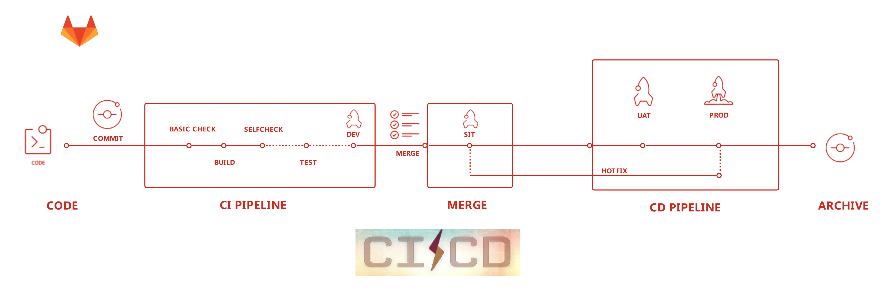
## Components
### Code
By default, each commit will trigger a pipeline automatically exclude commit message contains **[skip ci].**
### CI PIPELINE
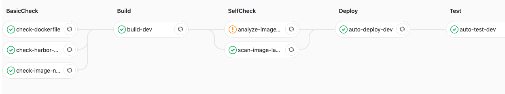
This components contains **FIVE STAGES** which are **BasicCheck, Build, SelfCheck, DeployDev, Auto-test**. It automatic runs totally.

**BasicCheck**
- check Dockerfile
- check harbor permissions
- check image name

**Build**
- build docker image
- generate helm package
- update helm version in consul

**SelfCheck**
- scan image security
- analyse image size

**DeployDev**
- auto deploy to Dev

**AutoTest**
- health check

### MERGE
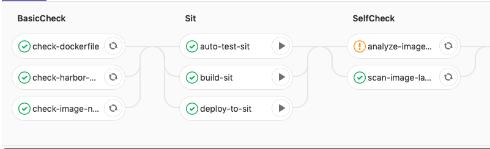
> This component connects CI and CD pipeline, also it plays an important role in cross branches operation. Usually, engineer develops in dev branch. CI pipeline ensures the new feature quality. Once some feature needs integration test, engineer will merge related code to sit branch which will enter in CD pipeline.

### CD PIPELINE
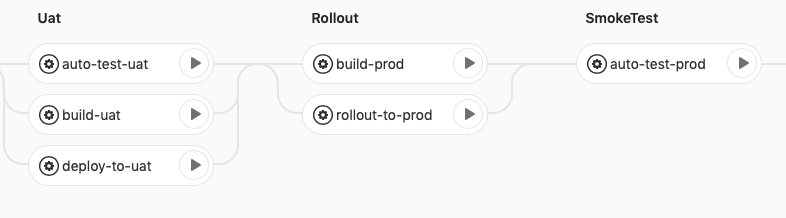
- build sit

- deploy sit

- deploy uat

- deploy prod

- smoke test

### ARCHIVE

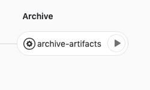

> Each release of prod, we will archive not only gitlab, but also helm package in case of roll back.

### Integration & Manual

#### OverView
First of all, everything is based on GitLab CI which means you must have **a gitlab project** to start integration. I will provide an example to explain how to integrate.
#### Example

**Step 1**
Create a file named *.gitlab-ci.yml* under your project root dir. 

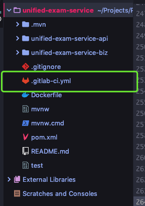
> This project, unified-exam-service, is going to integrate with GitLab CI. The .gitlab-ci.yml is located in the project root.

**Step 2**
Modify .gitlab-ci-yml as follows.
```bash
# vi .gitlab-ci.yml

variables:
  INCLUDE: “main.yml” # this is required! It defines what template to include. At present, we only provide `main.yml` template.

init-project:
  script:
    - git archive —remote=git@gitlab.aidoin.com:DevOps/templates.git  HEAD:gitlab-ci init.py |tar -x # this is required! Please DO NOT change it!
    - python3 init.py # this is required! Please DO NOT change it!
  tags:
    - init # this is required! Please DO NOT change it!
  artifacts:
    paths:
      - gitlab-ci-init.yml # this is required! Please DO NOT change it!
```
**Step 3**
1. Commit and push .gitlab-ci.yml. Then check your project website left menu .
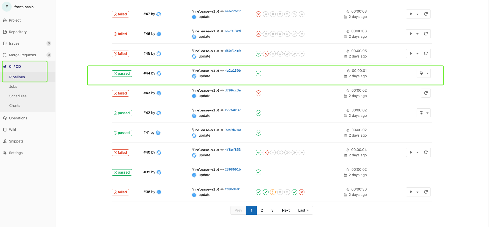

2. You will find a pipeline which looks like above image. Then click icon.
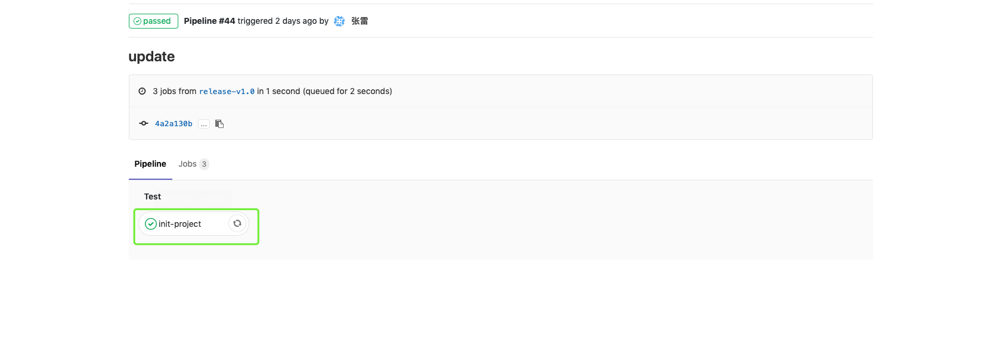

3. Then click , you will see the notice message “please download artifacts and rename gitlab-ci-init.yml to .gitlab-ci.yml under your project root dir!”
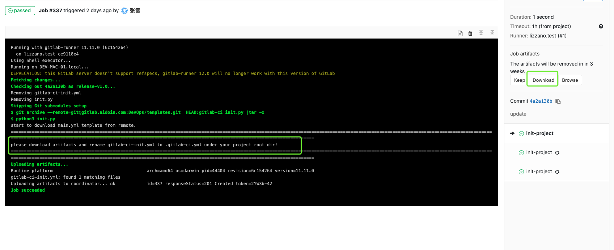

4. Then click the  in the right area.

5. At last overwrite your .gitlab-ci.yml with the downloaded file then commit and push it!
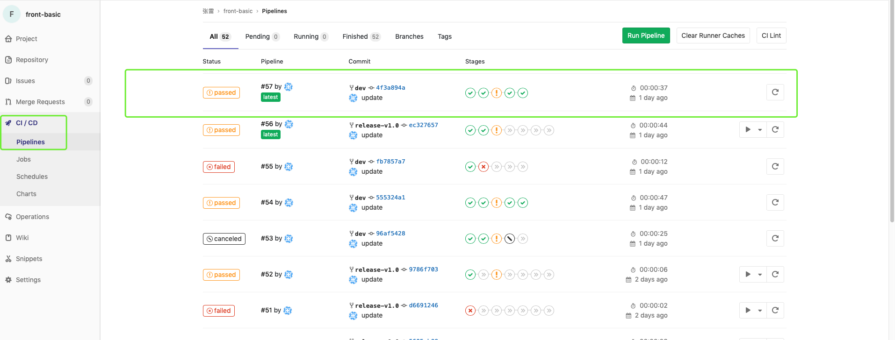

6. If you see the above pipeline under your CI/CD menu, congratulations! Happy GitLab CI!

### Requirement

1. All build is based on Dockerfile.

2. All deploy is based on Helm.

### Advantages & Disadvantages

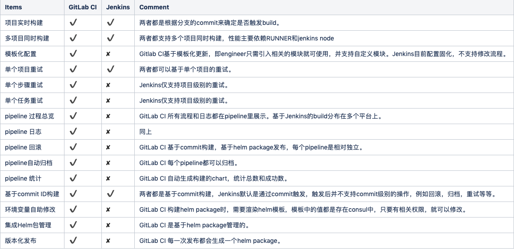